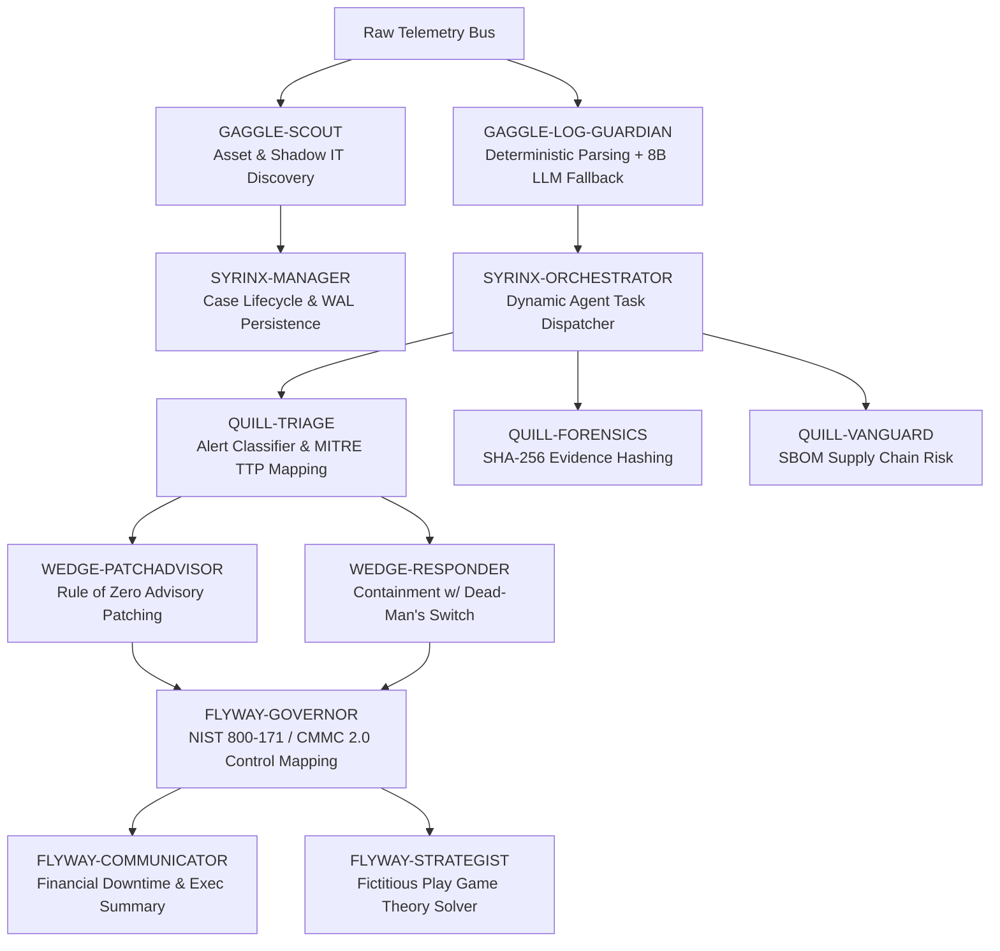

# Sentinel Agentic SOC: Autonomous Security Operations & Continuous Compliance Engine

[](#governance-risk--compliance-grc-architecture)
[](#ai-governance--safety-guardrails)
[](#the-25-agent-hive-mind-matrix)
[-orange.svg)](#multi-head-llm-infrastructure--hardware-efficiency)

**Sentinel Agentic SOC** is a state-of-the-art, multi-agent AI architecture engineered to bridge the gap between autonomous threat detection, technical security operations, and continuous IT auditing. 

Built on a **25-agent digital hive mind**, Sentinel transforms point-in-time security audits into **continuous, code-driven control evaluations**, while enforcing strict **AI governance guardrails**, cryptographic evidence integrity, and quantitative risk modeling.

---

## Executive Summary & IT Audit Alignment

Modern enterprise security and IT audit teams face two critical challenges: **audit fatigue from point-in-time compliance checks** and **uncontrolled operational risks from autonomous AI tools**. 

Sentinel solves both by delivering an autonomous SOC ecosystem designed with auditing as a first-class citizen:

* **Continuous Control Monitoring (CCM)**: Automatically evaluates incoming telemetry against **NIST SP 800-171** and **CMMC 2.0** control domains in real time.
* **Auditable AI Guardrails**: Enforces human-in-the-loop (HITL) approval gates, separation of duties (SoD), and the "Rule of Zero" safety protocol for autonomous remediation.
* **Tamper-Evident Evidence**: Cryptographically seals forensic artifacts with **SHA-256 hashes** at collection time and maintains state via Write-Ahead Logging (WAL).
* **Local & Cost-Efficient**: Runs entirely on edge hardware (VRAM-constrained to **16GB**) using a **Multi-Head LLM architecture** managed by Pydantic AI.

---

## Governance, Risk & Compliance (GRC) Architecture

Sentinel incorporates specialized business and governance agents to ensure every technical alert is evaluated against enterprise risk and compliance controls:



### Key Audit & Governance Modules

| Agent / Module | Audit & Compliance Focus | Key Capability |
| :--- | :--- | :--- |
| **`FLYWAY-GOVERNOR`** | **NIST 800-171 / CMMC 2.0** | Real-time cross-mapping of security events to compliance control families; autonomous triage tuning loop. |
| **`WEDGE-PATCHADVISOR`** | **Change Control & SoD** | Enforces the "Rule of Zero"; drafts context-aware mitigation scripts for human validation, **never** auto-executing. |
| **`WEDGE-RESPONDER`** | **Controlled Remediation** | Performs host isolation and process termination with asset criticality risk bounds and an automated **dead-man's switch**. |
| **`GAGGLE-SCOUT`** | **CIS Controls 1 & 2** | Agentless discovery, diffing, and continuous tracking of Shadow IT, unpatched legacy hardware, and default PLC credentials. |
| **`QUILL-FORENSICS`** | **NIST AU-9 / AU-12 Audit Integrity** | Applies **SHA-256 integrity seals** at point of evidence collection; structures chronological forensic sub-histories. |
| **`QUILL-VANGUARD`** | **Vendor Risk & Supply Chain** | Ingests Software Bill of Materials (SBOMs) to instantly evaluate zero-day impacts (e.g., Log4Shell) on nested dependencies. |
| **`QUILL-GATEKEEPER`** | **Identity & Zero Trust** | Audits Non-Human Identities (NHIs), rotates agent API keys, and detects MFA fatigue or impossible travel. |
| **`FLYWAY-STRATEGIST`** | **Quantitative Risk Modeling** | Fictitious Play algorithm calculating Mixed-Strategy Nash Equilibrium (MSNE) probabilities for defensive asset allocation under scarcity. |

---

## AI Governance & Safety Guardrails

To address **NIST AI Risk Management Framework (AI RMF)** requirements, Sentinel implements strict operational constraints over autonomous AI behavior:

1. **Rule of Zero (Separation of Duties)**: Advisory agents (`WEDGE-PATCHADVISOR`) are architecturally forbidden from executing root/SYSTEM actions. Remediation actions must be reviewed in the Human-In-The-Loop (HITL) Queue.
2. **Deterministic-First Ingestion**: `GAGGLE-LOG-GUARDIAN` handles 90% of log parsing deterministically using Grok/Regex patterns. Only unrecognized formats trigger the 8B Reasoning LLM, eliminating syntactic hallucinations.
3. **Dead-Man's Switch**: If `WEDGE-RESPONDER` loses connection with `SYRINX-MANAGER` during an isolated state, host isolation auto-reverts to prevent operational disruption.
4. **Self-Healing Hive Monitoring**: `GAGGLE-WATCHDOG` continuously monitors agent token usage, latency, and response consistency, triggering automatic restart directives on performance lag.

---

## The 25-Agent Hive Mind Matrix

Sentinel's architecture is segmented into **5 specialized strategic pillars**:

### 0. Core Orchestration Layer (The Brain)
* **`SYRINX-MANAGER`** ([`investigation_manager.py`](./backend/soc/agents/orchestration/investigation_manager.py)): Case lifecycle management, SQLite/WAL persistence, and Quantum-Resistant X25519 mTLS service mesh enforcement.
* **`SYRINX-ORCHESTRATOR`** ([`orchestrator.py`](./backend/soc/agents/orchestration/orchestrator.py)): High-level multi-agent dispatcher with priority lane queuing for OT/IT alerts.

### 1. Operations Pillar (Surveillance & Ingestion)
* **`GAGGLE-SCOUT`** ([`scout.py`](./backend/soc/agents/operations/scout.py)): Agentless asset discovery, shadow IT diffing, and inventory delta tracking.
* **`GAGGLE-TOPOLOGY`** ([`topology_mapper.py`](./backend/soc/agents/operations/topology_mapper.py)): Dynamic relationship graph mapping User -> Host -> Service.
* **`GAGGLE-LOG-GUARDIAN`** ([`log_guardian.py`](./backend/soc/agents/operations/log_guardian.py)): NLP-guided schema normalization with LLM fallback.
* **`GAGGLE-TRAFFIC-SIEVE`** ([`traffic_sieve.py`](./backend/soc/agents/operations/traffic_sieve.py)): Netflow analysis and anomalous exfiltration pattern detection.
* **`GAGGLE-WATCHDOG`** ([`watchdog.py`](./backend/soc/agents/operations/watchdog.py)): Real-time agent heartbeat monitoring and token burn tracking.

### 2. Intelligence Pillar (Cognitive Investigation)
* **`QUILL-TRIAGE`** ([`triage.py`](./backend/soc/agents/intelligence/triage.py)): Alert classification, noise suppression, and MITRE ATT&CK mapping.
* **`QUILL-CORRELATOR`** ([`correlator.py`](./backend/soc/agents/intelligence/correlator.py)): 48-hour temporal sliding window for multi-stage attack chain detection.
* **`QUILL-LIBRARIAN`** ([`librarian.py`](./backend/soc/agents/intelligence/librarian.py)): Vector RAG memory service providing sub-second semantic search.
* **`QUILL-HUNTER`** ([`hunter.py`](./backend/soc/agents/intelligence/hunter.py)): Hypothesis-driven threat hunting for APT and living-off-the-land techniques.
* **`QUILL-ENDPOINT-ANALYST`** ([`endpoint_analyst.py`](./backend/soc/agents/intelligence/endpoint_analyst.py)): Memory forensics, Sysmon process tree inspection, and execution triage.
* **`QUILL-INVESTIGATOR`** ([`investigator.py`](./backend/soc/agents/intelligence/investigator.py)): Chain-of-Thought (CoT) root cause analysis.
* **`QUILL-FORENSICS`** ([`forensics.py`](./backend/soc/agents/intelligence/forensics.py)): Artifact isolation with SHA-256 hashing.
* **`QUILL-MALWARE-PATHOLOGIST`** ([`malware_pathologist.py`](./backend/soc/agents/intelligence/malware_pathologist.py)): Static and dynamic binary analysis in sandbox environments.
* **`QUILL-GATEKEEPER`** ([`gatekeeper.py`](./backend/soc/agents/intelligence/gatekeeper.py)): Identity governance, MFA fatigue detection, and NHI credential rotation.
* **`QUILL-VANGUARD`** ([`vanguard.py`](./backend/soc/agents/intelligence/vanguard.py)): SBOM dependency reconciliation and vendor risk assessment.
* **`QUILL-MIRAGE`** ([`mirage.py`](./backend/soc/agents/intelligence/mirage.py)): Honeypot, CAD share decoy, and canary credential operations.

### 3. Action Pillar (Response & Remediation)
* **`WEDGE-PATCHADVISOR`** ([`patch_advisor.py`](./backend/soc/agents/action/patch_advisor.py)): Context-aware mitigation script generation for human review.
* **`WEDGE-RESPONDER`** ([`responder.py`](./backend/soc/agents/action/responder.py)): Automated containment with dead-man switch safety.

### 4. Business Pillar (Governance & Strategy)
* **`FLYWAY-GOVERNOR`** ([`governor.py`](./backend/soc/agents/business/governor.py)): Compliance cross-mapping (NIST 800-171/CMMC) and algorithm tuning.
* **`FLYWAY-COMMUNICATOR`** ([`communicator.py`](./backend/soc/agents/business/communicator.py)): Tri-factor single-pass synthesis (Financial impact, executive summary, paging).
* **`FLYWAY-HISTORIAN`** ([`historian.py`](./backend/soc/agents/business/historian.py)): Long-dwell rare event tracking (30+ day silence awakenings).
* **`FLYWAY-STRATEGIST`** ([`game_theory_solver.py`](./backend/soc/agents/business/game_theory_solver.py)): Fictitious Play zero-sum game theory defender allocation.

---

## Multi-Head LLM Infrastructure & Hardware Efficiency

To optimize performance and eliminate cloud API costs, Sentinel utilizes a **Multi-Head Local LLM Allocation** designed for single-GPU local deployment (**16GB VRAM target**):

```
       ┌──────────────────────────────────────────────────────────┐
       │                Sentinel Multi-Head Engine               │
       └────────────────────────────┬─────────────────────────────┘
                                    │
         ┌──────────────────────────┼──────────────────────────┐
         ▼                          ▼                          ▼
 ┌───────────────┐          ┌───────────────┐          ┌───────────────┐
 │Reasoning Head │          │Syntactic Head │          │Embedding Head │
 │  llama3.1:8b  │          │  gemma4:e4b   │          │nomic-embed-txt│
 │ (~7.0 GB VRAM)│          │ (~2.5 GB VRAM)│          │ (~1.5 GB VRAM)│
 └───────┬───────┘          └───────┬───────┘          └───────┬───────┘
         │                          │                          │
         ▼                          ▼                          ▼
  Deep Analysis             Executive Summaries         RAG Case Search
  & Compliance              & Paging Reports            & Vector Memory
```

* **Framework**: Pydantic AI for type-safe, structured JSON agent returns.
* **OLLAMA Configuration**:
  * `OLLAMA_MAX_VRAM=16GB`
  * `OLLAMA_NUM_PARALLEL=4` (Enables concurrent multi-agent reasoning)
  * `OLLAMA_KEEP_ALIVE=-1` (Persistent memory resident model execution)
* **Total VRAM Consumption**: `~11.0 GB` - leaving safety buffers for system overhead.

---

## Repository Structure

```
Agentic-SOC/
├── backend/
│   ├── main.py                   # FastAPI Engine & Event Bus Entrypoint
│   ├── final_hive_audit.py       # Comprehensive System Benchmark & Verification Suite
│   ├── .env.example              # Environment Variable Template
│   └── soc/
│       ├── agents/               # 25 Specialized Agent Implementations
│       │   ├── action/           # WEDGE-RESPONDER, WEDGE-PATCHADVISOR
│       │   ├── business/         # FLYWAY-GOVERNOR, FLYWAY-COMMUNICATOR, FLYWAY-STRATEGIST
│       │   ├── intelligence/     # QUILL-INVESTIGATOR, QUILL-FORENSICS, QUILL-TRIAGE, etc.
│       │   ├── operations/       # GAGGLE-SCOUT, GAGGLE-LOG-GUARDIAN, GAGGLE-WATCHDOG, etc.
│       │   └── orchestration/    # SYRINX-MANAGER, SYRINX-ORCHESTRATOR
│       ├── engine/               # Model Registry & Pydantic AI Interfaces
│       └── reports/              # SQLite Incident Case Databases & Forensic Logs
├── frontend/                     # React + Vite Operator Dashboard (Branta Agent)
│   ├── src/components/           # Investigation Canvas, Governance Pane, HiveHealth, etc.
│   └── package.json
├── docker/                       # Containerized Environment Deployments
├── agent_manifest.md             # Detailed Agent Specifications
└── gui_feature_report.md         # Dashboard GUI Feature Breakdown
```

---

## Quickstart & Setup

### Prerequisites
* **Python**: 3.10+
* **Ollama**: Installed locally with models (`llama3.1:8b`, `gemma4:e4b`, `nomic-embed-text`)
* **Node.js**: 18+ (for Frontend Dashboard)

### 1. Backend Installation & Benchmark Audit

```bash
# Clone Repository
git clone https://github.com/your-username/Agentic-SOC.git
cd Agentic-SOC/backend

# Create Virtual Environment & Install Dependencies
python -m venv .venv
source .venv/bin/activate  # On Windows: .venv\Scripts\activate
pip install -r requirements.txt

# Copy Environment Configuration
cp .env.example .env

# Run System-Wide Hardening & Hive Audit Benchmark
python final_hive_audit.py
```

### 2. Launching the Backend Engine

```bash
uvicorn main:app --reload --port 8000
```

### 3. Launching the Operator Dashboard

```bash
cd ../frontend
npm install
npm run dev
```

Navigate to `http://localhost:5173` to access the **Branta Agent Dashboard**.

---

## License & Attribution

Architected by **Kyler Reetz** | Cloud Security Architect & GRC Automation Specialist.

Distributed under the MIT License. See `LICENSE` for details.
