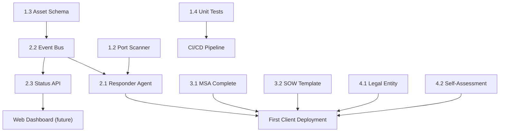

# RCA Technology Infrastructure Plan
**Reetz Cyber Automation — Agentic SOC**
*Updated: March 15, 2026*

---

## Current State Snapshot

The 4-pillar repo structure is in place. Below is a quick health-check of each pillar.

| Pillar | Directory | Status |
|---|---|---|
| 🔧 The Engine | `engine/` | ✅ Hardening & Core API complete |
| 🛡️ The SOC | `soc/` | ✅ Agents built, integration gaps exist |
| 📦 The Market Kit | `market_kit/` | 🟡 Skeleton docs only |
| 🏢 The Shield | `business/` | 🔴 Empty – not started |

---

## Pillar 1 — The Engine (`engine/`)

### What's Built
- [sentinel.py](file:///c:/Users/kyler/Documents/GitHub/Agentic%20SOC/engine/core/sentinel.py) — Passive sniff + ARP + ICMP discovery ✅
- [industrial.py](file:///c:/Users/kyler/Documents/GitHub/Agentic%20SOC/engine/core/industrial.py) — Modbus / EtherNet/IP probe ✅
- [mapper.py](file:///c:/Users/kyler/Documents/GitHub/Agentic%20SOC/engine/core/mapper.py) — NIST 800-171 Rev 2 & Rev 3 compliance matrix generation ✅
- [detector.py](file:///c:/Users/kyler/Documents/GitHub/Agentic%20SOC/engine/core/detector.py) — Local OS hardening checks ✅
- [schemas/nist_rev2.json](file:///c:/Users/kyler/Documents/GitHub/Agentic%20SOC/engine/schemas/nist_rev2.json), [schemas/nist_rev3.json](file:///c:/Users/kyler/Documents/GitHub/Agentic%20SOC/engine/schemas/nist_rev3.json) — Control definitions ✅
- [engine/core/__init__.py](file:///c:/Users/kyler/Documents/GitHub/Agentic%20SOC/engine/core/__init__.py) — Lazy-loading public API surface ✅
- [engine/core/portscanner.py](file:///c:/Users/kyler/Documents/GitHub/Agentic%20SOC/engine/core/portscanner.py) — IT/OT port scanner (NIST 3.11.2) ✅
- [engine/schemas/asset_schema.json](file:///c:/Users/kyler/Documents/GitHub/Agentic%20SOC/engine/schemas/asset_schema.json) — Canonical JSON asset schema ✅
- [engine/tests/](file:///c:/Users/kyler/Documents/GitHub/Agentic%20SOC/engine/tests/) — Pytest suite (Sentinel, Mapper, Scanner, Detector) ✅

### Next Steps
*All Phase 1 core library hardening tasks complete.*

---

## Pillar 2 — The SOC (`soc/`)

### What's Built
- [main.py](file:///c:/Users/kyler/Documents/GitHub/Agentic%20SOC/main.py) — Unified Typer CLI with `start`, `list`, `approve` subcommands. ✅
- [soc/api/main.py](file:///c:/Users/kyler/Documents/GitHub/Agentic%20SOC/soc/api/main.py) — FastAPI Status Layer for real-time SOC monitoring. ✅
- [Market Kit](file:///c:/Users/kyler/Documents/GitHub/Agentic%20SOC/market_kit/) — Full Legal (MSA/SOW) and Sales (Pitch/Brief/Copy) kit. ✅
- [scout.py](file:///c:/Users/kyler/Documents/GitHub/Agentic%20SOC/soc/agents/scout.py), [triage.py](file:///c:/Users/kyler/Documents/GitHub/Agentic%20SOC/soc/agents/triage.py), [responder.py](file:///c:/Users/kyler/Documents/GitHub/Agentic%20SOC/soc/agents/responder.py) ✅
- [bus/event_queue.py](file:///c:/Users/kyler/Documents/GitHub/Agentic%20SOC/soc/bus/event_queue.py), [bootstrap.py](file:///c:/Users/kyler/Documents/GitHub/Agentic%20SOC/soc/bootstrap.py) ✅

### Next Steps

#### 4.1 — Pillar 4: Operational Shield
Expand business workflows and infrastructure.
- Formalize [Lab_Setup.md](file:///c:/Users/kyler/Documents/GitHub/Agentic%20SOC/business/lab/Lab_Setup.md)
- Implement automated billing/reporting hooks in `main.py`.

---

## Pillar 3 — The Market Kit (`market_kit/`)

### What's Built
- `sales/Pitch_Deck_Outline.md` — 10-slide deck outline ✅
- `legal/Master_Service_Agreement.md` — MSA draft (incomplete) ✅

### Next Steps

#### 3.1 — Complete the MSA (`market_kit/legal/Master_Service_Agreement.md`)
Missing critical sections for a deployable contract:
- **§6 Data Handling & Confidentiality** — How network scan data is stored/deleted
- **§7 Statement of Work Template** — Scope, deliverables, pricing tiers
- **§8 Incident Notification SLA** — RCA's obligation to alert the client within X hours

#### 3.2 — SOW Template (`market_kit/legal/Statement_of_Work_Template.md`)
A reusable SOW with fill-in-the-blank fields for:
- Client name, site address, subnet ranges
- Engagement tier (Audit-Only / Scout+Audit / Full Agentic SOC)
- Monthly retainer fee

#### 3.3 — One-Page Capability Brief (`market_kit/sales/Capability_Brief.md`)
A concise, leave-behind document (suitable for printing) covering the three-tier service model and CMMC deadline urgency. More actionable than a deck for cold outreach.

#### 3.4 — Pricing Model (`market_kit/sales/Pricing_Model.md`)
Define and document the three tiers so sales conversations are consistent:
| Tier | Deliverable | Target Price |
|---|---|---|
| Audit-Only | First-Run Audit + PDF Report | $TBD |
| Scout + Audit | Continuous monitoring + quarterly reports | $TBD/mo |
| Full Agentic SOC | All agents + incident response | $TBD/mo |

---

## Pillar 4 — The Operational Shield (`business/`)

> [!WARNING]
> This entire pillar is empty. It must be bootstrapped before any client contracts are signed.

### Next Steps

#### 4.1 — Legal Entity Documentation (`business/legal/`)
Store and track:
- LLC Operating Agreement (obtain from attorney)
- EIN confirmation letter
- Registered agent paperwork

#### 4.2 — NIST Self-Assessment (`business/compliance/rca_self_assessment.md`)
RCA selling NIST compliance services must itself maintain a NIST posture. Document:
- Which of the 110 NIST 800-171 controls RCA satisfies internally
- Known gaps + remediation plan
- Reassessment schedule (annual minimum)

#### 4.3 — Lab Environment Spec (`business/lab/lab_spec.md`)
Document the private test lab used for "air-gapped testing" referenced in the pitch deck:
- Hardware list (router, switch, test PLCs/HMIs if any)
- Network topology diagram
- Purpose: validate RCA engine against real OT hardware before client deployments

#### 4.4 — Branding Assets (`business/branding/`)
- Logo (SVG + PNG variants)
- Color palette & typography spec
- Email signature template
- Business card template

---

## Dependency & Priority Order

## Recommended Sprint Order

| Sprint | Focus | Key Deliverables |
|---|---|---|
| **Week 1** | Engine hardening | ✅ Complete (Port scanner, asset schema, tests) |
| **Week 2** | SOC pipeline | Event bus, report dir structure, `bootstrap.py` |
| **Week 3** | Responder MVP | `responder.py` with approval gate, incident log |
| **Week 4** | Market Kit | MSA §6-8, SOW template, pricing model |
| **Week 4** | Shield bootstrap | Self-assessment doc, lab spec, legal entity folder |
| **Week 5** | API layer | FastAPI status/inventory/alerts endpoints |
| **Week 6** | Integration test | End-to-end: Scout → Triage → Responder → Audit PDF |
