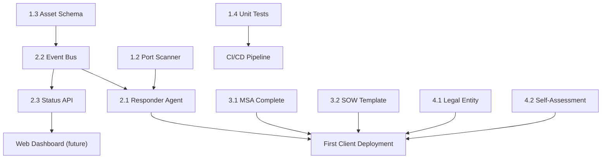

# RCA Technology Infrastructure Plan
**Reetz Cyber Automation — Agentic SOC**
*Updated: March 18, 2026*

---

## Current State Snapshot

The 4-pillar repo structure is in place. Below is a quick health-check of each pillar.

#### 4.1 — Pillar 4: Operational Shield
Expand business workflows and infrastructure.
- Formalize [Lab_Setup.md](file:///c:/Users/kyler/Documents/GitHub/Agentic%20SOC/business/lab/Lab_Setup.md)
- Implement automated billing/reporting hooks in `main.py`.

#### 3.4 — Pricing Model (`market_kit/sales/Pricing_Model.md`)
Define and document the three tiers so sales conversations are consistent:
| Tier | Deliverable | Target Price |
|---|---|---|
| Audit-Only | First-Run Audit + PDF Report | $TBD |
| Scout + Audit | Continuous monitoring + quarterly reports | $TBD/mo |
| Full Agentic SOC | All agents + incident response | $TBD/mo |

---

## Pillar 4 — The Operational Shield (`business/`)

> [!WARNING]
> This entire pillar is empty. It must be bootstrapped before any client contracts are signed.

### Next Steps

#### 4.1 — Legal Entity Documentation (`business/legal/`)
Store and track:
- LLC Operating Agreement (obtain from attorney)
- EIN confirmation letter
- Registered agent paperwork

#### 4.2 — NIST Self-Assessment (`business/compliance/rca_self_assessment.md`)
RCA selling NIST compliance services must itself maintain a NIST posture. Document:
- Which of the 110 NIST 800-171 controls RCA satisfies internally
- Known gaps + remediation plan
- Reassessment schedule (annual minimum)

#### 4.3 — Lab Environment Spec (`business/lab/lab_spec.md`)
Document the private test lab used for "air-gapped testing" referenced in the pitch deck:
- Hardware list (router, switch, test PLCs/HMIs if any)
- Network topology diagram
- Purpose: validate RCA engine against real OT hardware before client deployments

#### 4.4 — Branding Assets (`business/branding/`)
- Logo (SVG + PNG variants)
- Color palette & typography spec
- Email signature template
- Business card template

---

## Dependency & Priority Order

## Recommended Sprint Order

| Sprint | Focus | Key Deliverables |
|---|---|---|
| **Week 1** | Engine hardening | ✅ Complete (Port scanner, asset schema, tests) |
| **Week 2** | SOC pipeline | ✅ Event bus, report structure, `bootstrap.py` |
| **Week 3** | Reorganization | ✅ Ethos, Docker, and Test directory cleanup |
| **Week 4** | Market Kit | MSA §6-8, SOW template, pricing model |
| **Week 4** | Shield bootstrap | Self-assessment doc, lab spec, legal entity folder |
| **Week 5** | API layer | FastAPI status/inventory/alerts endpoints |
| **Week 6** | Integration test | End-to-end: Scout → Triage → Responder → Audit PDF |

|We have another sleeper! We had created a copilot chatbot tab. We need to turn this into an internal model if that holds value.|